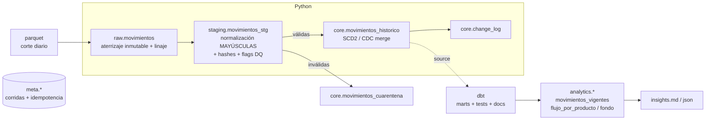
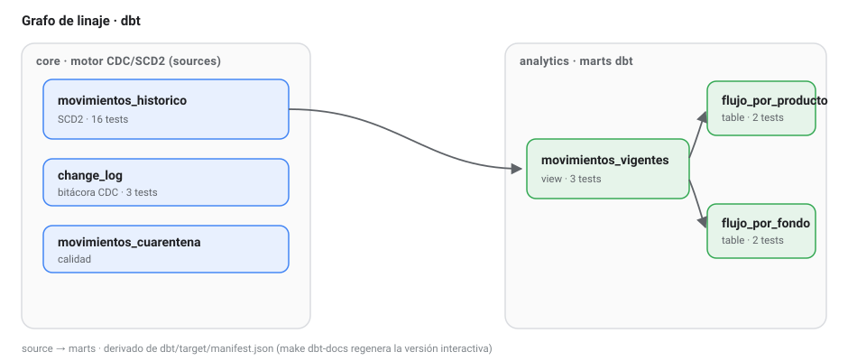
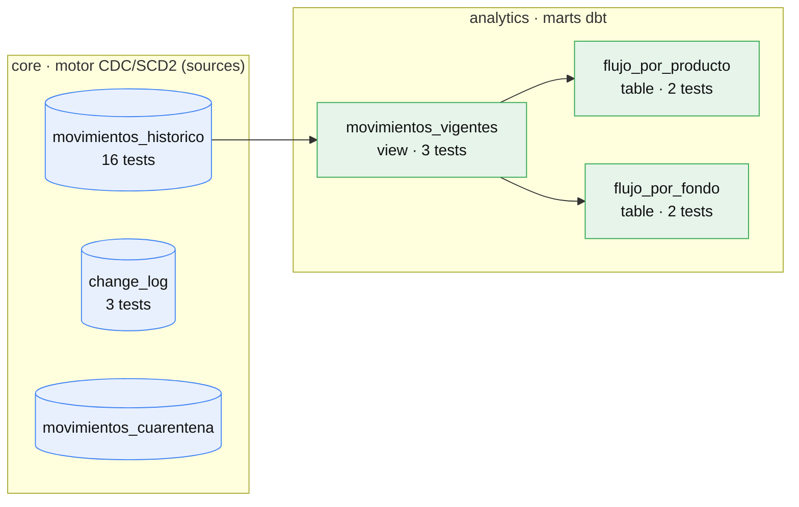

# Pipeline de Movimientos Financieros — Tyba

[](https://github.com/hecortes123/Tyba_Pipeline/actions/workflows/ci.yml)
&nbsp;·&nbsp; Python · DuckDB · dbt · Docker

Pipeline de ingeniería de datos de extremo a extremo que ingiere los cortes
diarios de movimientos financieros, consolida su evolución día a día con
**Historico SCD Tipo 2 / CDC** y produce una base **consultable, consistente
y trazable**, más una capa **dbt** de marts, tests y documentación de linaje.

Este desarrollo hace parte de la prueba técnica del proceso de selección para 
la posición **Senior Data Engineer** para la compañía Tyba - Credicorp.

> **TL;DR** — El reto es, en el fondo, un problema de **Change Data Capture**:
> Se requiere ver cómo evoluciona cada movimiento entre cortes (nuevo / corregido /
> eliminado / sin cambios) sin perder trazabilidad ni duplicar. Se resuelve con un
> **motor CDC/SCD2 propio en SQL sobre DuckDB** 
> y una **capa dbt encima** que aporta tests declarativos, documentación y linaje. 
> Diseñado para escalar a millones de filas sin perder rendimiento.

---
# PASO A PASO PARA SU EJECUCIÓN 

## 1. Ejecución

```bash
docker compose up --build
```

Eso construye la imagen y ejecuta el pipeline completo:
`ingesta → staging → CDC/SCD2 (Python) → dbt build (marts + tests + docs) → insights`.

Genera en `data/output/`:

- `tyba.duckdb` — base consultable (histórico + cuarentena + marts de analítica)
- `insights.md` / `insights.json` — reporte de insights

Volver a correrlo es **idempotente**: no duplica ni recalcula el histórico.

### Ejecución local (sin Docker)

```bash
pip install -r requirements.txt
python -m src.pipeline --all         # pipeline completo (Python + dbt)
python -m src.pipeline --all --reset # desde cero
python -m src.pipeline --all --skip-dbt  # solo motor Python (marts vía vistas)

pytest tests/ -v                     # tests del motor CDC/SCD2
make dbt-test                        # solo los tests dbt
make dbt-docs                        # documentación + grafo de linaje (localhost:8080)
```

### Consultar los resultados

```bash
duckdb data/output/tyba.duckdb
```
```sql
SELECT * FROM analytics.movimientos_vigentes LIMIT 10;         -- estado vigente (mart dbt)
SELECT * FROM analytics.flujo_por_producto;                    -- flujo neto por producto
SELECT cut_label, change_type, COUNT(*)                        -- evolución CDC
FROM core.change_log GROUP BY 1,2 ORDER BY 1,2;
-- Trazabilidad SCD2: historia completa de un movimiento
SELECT movement_key, change_type, is_current, is_deleted, valid_from, valid_to, amount
FROM core.movimientos_historico ORDER BY movement_key, valid_from;
```

---

## 2. Arquitectura

Metodología **medallion** con un patron claro: **Python** posee la ingesta y el motor
CDC/SCD2 (el core del pipeline); **dbt** posee los marts, los tests y la documentación.



| Capa | Contenido | Dueño |
|---|---|---|
| `raw` | parquet tal cual + linaje (`_source_file`, `_cut_date`, `_load_ts`, `_row_num`) | Python |
| `staging` | tipado, normalizado a MAYÚSCULAS, `business_key_hash`, `attr_hash`, flags DQ | Python |
| `core` | histórico SCD2, cuarentena, bitácora de cambios | Python (motor CDC/SCD2) |
| `analytics` | marts: estado vigente y flujo neto | **dbt** |
| `meta` | corridas e idempotencia | Python |

**Stack:** Python · DuckDB · **dbt-duckdb** · Docker. 

¿Por qué DuckDB?
Lee archivos parquet de forma nativa, es embebido y columnar/vectorizado; el SQL y los modelos
dbt son facilmente escalables a Postgres,Snowflake o BigQuery si se desea migrar a futuro.

---

## 3. Decisión central: Definir la clave de negocio

**Hallazgo crítico:** el glosario del documento proporcionado menciona `id` = *identificador de transacción*,
sin embargo el archivo trae únicamente `id_cliente`, que **no es único** (3.000 clientes
en 50.000 filas aprox. → cerca de 17 movimientos por cliente). **No existe un id de transacción
en los archivos fuente.** A nivel cliente hay 0 nuevos y 0 eliminados entre T y T1, así que la
premisa nuevo/corregido/eliminado **no aplica al nivel de cliente**.

Como no hay clave natural única, se **sintetizó** y se justificó. La identidad
de un movimiento se define con las columnas que describen el hecho y que una
corrección de atributos **no** debería alterar:

```
CLAVE DE NEGOCIO   = (id_cliente, date, product, type, fund)
ATRIBUTOS MUTABLES = (amount, description, commercial_name)   ← lo que una corrección edita
```

### Los dos hashes (con normalización previa obligatoria)

Se calculan **después** de normalizar (si no, valores sucions como `entrada` y `ENTRADA` darían hashes
distintos y el mismo movimiento se vería duplicado):

- **`business_key_hash`** = `md5` de la clave de negocio normalizada → **identidad**
  (llave de una sola columna para joins e índices) → Nos asegura mantenibilidad.
- **`attr_hash`** = `md5` de los atributos mutables normalizados → **detección de
  cambios**: misma clave + `attr_hash` distinto ⇒ **corrección**. Comparar un solo
  hash en vez de columna por columna hace el CDC barato y escalable.

Robustez: separador `||` (ausente en los datos) y centinela `<NULL>` para distinguir
NULL de vacío.

### Colisiones intra-corte

La clave tiene cerca del 0.13% de colisiones dentro de un corte (un cliente con dos
movimientos idénticos en fecha/producto/tipo/fondo que solo difieren en el monto).
Se resuelven con un **índice de ocurrencia determinista** (`occurrence_seq`):

```
movement_key = md5(business_key_hash || '#' || occurrence_seq)
```

---

## 4. Calidad de datos: hallazgos y decisiones

Política definida: A falta de un Id de Transacción que facilite el CDC se adopta el concepto **cuarentena** para lo que rompe la identidad y
**flag + normalización** para el resto, conservando siempre el dato crudo en `raw` para trazabilidad y auditoria.

| Hallazgo | Evidencia | Decisión |
|---|---|---|
| Sin `id` de transacción | `id_cliente` no único (17 filas/cliente aprox.) | Clave de negocio sintética |
| `type` sucio | 10 variantes: `entrada/Entrada/ENTRADA/IN/in` y `salida/Salida/SALIDA/OUT/out` | estandarizar a `{ENTRADA, SALIDA}`; Lo no mapeable va a cuarentena |
| `date` en 2 formatos | 93% llega `YYYY-MM-DD`, 7% `DD/MM/YYYY`, tipo texto | Parsear a `DATE`; lo no parseable a cuarentena |
| `amount` nulo | 3% | Se conserva la fila; se **flag**; excluido de las sumas del flujo |
| `amount` negativo | 1.034 filas | **Convención:** `amount` = magnitud y la dirección la define `type`. Un negativo es anomalía → **flag** |
| `amount` en cero | ~940 filas | Se conserva y se **flag** |
| `description` / `commercial_name` nulos | 9% / 17% respectivamente | Son campos opcionales: se conservan y se **flag** |
| Casing o espacios en `product`, `fund` | varios | Se estandariza con `UPPER(TRIM())` (MAYÚSCULAS sostenidas) |

**`signed_amount`**: magnitud con signo según `type` (`ENTRADA` +,
`SALIDA` −). Es la columna correcta para el flujo neto y neutraliza los signos crudos
incoherentes sin perder el original.

Columnas de la clave: **0 vacíos** en los datos entregados ⇒ **0 en cuarentena** en
esta corrida. Nota: el mecanismo queda listo para datos futuros más sucios.

---

## 5. Motor CDC / SCD Tipo 2 (Python)

Por cada corte, un único `FULL OUTER JOIN` entre el corte entrante (staging) y el
estado **vigente** del histórico clasifica y aplica:

| Situación | Regla | Acción en el histórico |
|---|---|---|
| **Nuevo** | La clave existe en el corte pero no está vigente | nueva versión `INSERT` |
| **Corregido** | La clave existe pero `attr_hash` es distinto | cierra versión vigente + nueva `UPDATE` |
| **Eliminado** | Una clave vigente ausente en el corte | cierra versión y se aplica **tombstone** (`is_deleted=true`) |
| **Sin cambios** | misma clave, mismo `attr_hash` | no se toca |
| **Reaparición** | clave eliminada que vuelve | reactivación como `INSERT` |

Cada versión guarda registros como `valid_from` / `valid_to` / `is_current` / `is_deleted` /
`change_type`; cada evento real queda en `core.change_log`. **Nunca se borra
historia** → Se asegura trazabilidad completa y auditoria. Todo corre dentro de una transacción.

### Resultado sobre los datos entregados

| Corte | Nuevos | Corregidos | Eliminados | Sin cambios |
|---|---:|---:|---:|---:|
| T (carga inicial) | 50.000 | 0 | 0 | 0 |
| T1 | 9.991 | 3.888 | 10.991 | 35.121 |

Consistencia verificada: `9.991 + 3.888 + 35.121 = 49.000` (filas de T1) y
`3.888 + 35.121 + 10.991 = 50.000` (filas de T). Estado final: **49.000 vigentes**,
**10.991 tombstones**, **74.870 versiones**, **3.000 clientes**.

---

## 6. Capa dbt — tests, docs y linaje

El motor CDC/SCD2 vive en Python, es nuestro core.
**dbt se monta encima**, tratando `core.*` como *sources*, y aporta sus mejores capacidades, sin duplicar el motor:

- **Marts versionados** (`dbt/models/marts/`): `movimientos_vigentes`,
  `flujo_por_producto`, `flujo_por_fondo`. La analítica queda como código con `ref()`,
  materializaciones declarativas y linaje.
- **Tests declarativos** sobre la salida del SCD2: `not_null` en la clave,
  `accepted_values` en `type` y `change_type`, y `unique` sobre `movement_key` en el
  estado vigente (prueba de que hay exactamente una versión vigente por movimiento).
- **Tests singulares** que codifican las **invariantes del SCD2** (`dbt/tests/`):
  - `assert_una_version_vigente_por_movimiento` — máximo un `is_current` por clave.
  - `assert_version_unica_por_corte` — `(movement_key, valid_from)` único.
  - `assert_coherencia_vigencia` — vigente ⇒ sin `valid_to`; cerrada ⇒ con `valid_to`.
- **Documentación + grafo de linaje**: `make dbt-docs` (o `dbt docs serve`) levanta el
  sitio navegable con descripciones de modelos/columnas y el DAG source → marts.

En cada corrida el pipeline ejecuta `dbt build` como un **quality gate**: si un test
falla, el pipeline se detiene. Verificado con una prueba negativa (inyectar una
segunda versión vigente hace fallar el test correspondiente). Total: **26 tests dbt
(23 declarativos + 3 singulares) + 3 modelos**, todos en verde sobre los datos reales.

### Grafo de linaje (derivado del manifest de dbt)



`dbt docs serve` levanta este mismo grafo de forma interactiva, con descripciones de
cada modelo y columna. (Corre `make dbt-docs` para regenerarlo desde el `manifest.json`.)

<details>
<summary>Fuente reproducible del grafo (Mermaid)</summary>



</details>

> **Handoff y lock de DuckDB:** DuckDB restringe varios usuarios escribiendo al tiempo, así que el orquestador
> **cierra la conexión de Python antes de invocar dbt** y la reabre después para los
> insights.

> Se implementó una solución hibrida en lugar de usar solamente dbt ya que el snapshot de dbt necesita una clave única
> que aquí **no esta presente** en el origen y se requiere configuracion extra
> para borrados y para usar la fecha de negocio como vigencia. Mantener el motor
> propio hace explícita esa lógica y deja a dbt lo que aporta más
> valor: pruebas de calidad, documentación y linaje.

---

## 7. Idempotencia, orden y observabilidad

- **Idempotencia doble:** (a) `meta.cuts_processed` guarda el `sha256` de cada archivo
  → reprocesar el mismo corte termina la ejecución del flujo inmediatamente; (b) el merge en sí es idempotente.
  `docker compose up` dos veces no cambia el histórico (dbt sí reconstruye los marts,
  que son deterministas).
- **Orden cronológico:** se rechaza ingerir un corte con `cut_date` anterior al último
  procesado.
- **Transaccionalidad:** el merge corre en `BEGIN/COMMIT` con `ROLLBACK` ante error.
- **Observabilidad:** `meta.pipeline_runs` registra por corrida filas
  origen/válidas/cuarentena y conteos I/U/D con timestamps y estado.

---

## 8. Diseño pensado para escala

- **Todo es SQL**: el CDC es un solo join.
- **DuckDB** es columnar, vectorizado y **out-of-core**: no depende de que
  el archivo quepa en la memoria. Se hace lectura directa del parquet con intentando hacer un pushdown de predicados y evitar hacer lecturas innecesarias de datos.
- **Cortes incrementales**, uno por día: no re-lee la historia.
- Los marts pesados pueden pasar a **materialización incremental** en dbt sin tocar el motor.
- Ruta de crecimiento: particionar el histórico por `cut_date` y mover a tablas tipo Iceberg o Delta
  para aprovechar el `MERGE` nativo y el *time travel*, y migrar el mismo modelo a un warehouse en la nube.

---

## 9. Estructura del proyecto

```
tyba-pipeline/
├── data/
│   ├── raw/            ← parquet entregados por Tyba (input)
│   └── output/         ← tyba.duckdb + insights.{md,json} (generado)
├── src/                ← motor Python
│   ├── config.py       ← clave de negocio, mapeos, manifiesto de cortes
│   ├── db.py           ← conexión DuckDB + DDL (bootstrap idempotente)
│   ├── ingest.py       ← aterrizaje raw + linaje + sha/idempotencia
│   ├── transform.py    ← normalización MAYÚSCULAS + hashes + flags + cuarentena
│   ├── scd2.py         ← motor CDC / SCD Tipo 2
│   ├── analytics.py    ← generación de insights (fallback de vistas)
│   ├── pipeline.py     ← orquestador (CLI) + handoff a dbt
│   └── logging_conf.py ← logging estructurado
├── dbt/                ← capa dbt (marts + tests + docs)
│   ├── dbt_project.yml
│   ├── profiles.yml    ← target DuckDB (misma base)
│   ├── models/
│   │   ├── sources.yml ← core.* como sources + tests declarativos
│   │   └── marts/      ← movimientos_vigentes, flujo_por_producto/fondo (+ marts.yml)
│   └── tests/          ← tests singulares de invariantes SCD2
├── tests/
│   └── test_pipeline.py ← pytest del motor: CDC (4 casos), normalización, cuarentena, idempotencia, reaparición
├── Dockerfile
├── docker-compose.yml
├── requirements.txt
├── Makefile
└── README.md
```

---

## 10. Pruebas

Dos capas complementarias:

- **`pytest tests/ -v`** — motor CDC/SCD2 sobre un dataset sintético controlado: los
  cuatro casos del CDC, normalización de `type`/`date` sucios a la misma identidad,
  cuarentena por fecha inválida, idempotencia del merge y reaparición.
- **`make dbt-test`** — 26 tests dbt (declarativos + singulares) sobre la salida real,
  como prueba de calidad ejecutable en cada corrida.

---

## 11. Como evolucionar este pipeline

- Usar el **`transaction_id` real** en el origen (elimina la síntesis de clave y sus colisiones).
- Orquestación con **Airflow/Prefect** (un DAG por día, reintentos con backoff, SLAs).
- **`dbt snapshot`** para el SCD2 nativo el día que exista clave única, e **incremental
  models** para los marts a gran volumen.
- **Great Expectations** o `dbt source freshness` para checkpoints y alertas.
- Particionamiento por `cut_date` e Iceberg/Delta para `MERGE` y *time travel*.
- Métricas del pipeline a Prometheus/Grafana.

**Elaborado por:** Héctor Cortés Hernández - hecortes123@gmail.com
